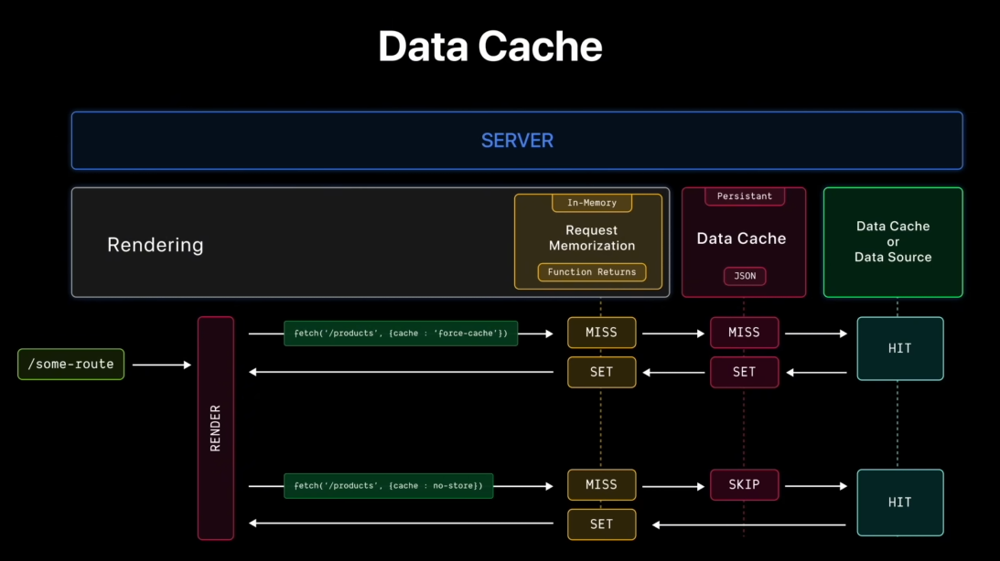
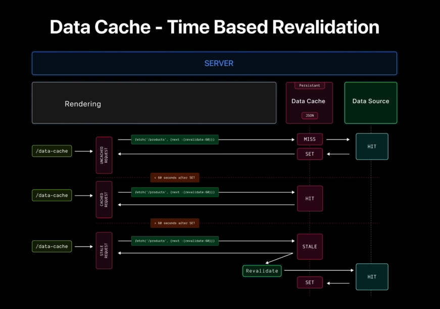

# ⚡ Cache de données dans Next.js

Ce document explique comment fonctionne le **cache de données ** dans **Next.js** lors du rendu côté serveur (SSR).  
Il présente les concepts de **cache persistant**, de **mémorisation des requêtes (in-memory)**, et de **révalidation automatique**.

---

## 🧩 Qu’est-ce que le cache de données dans Next.js ?

Next.js utilise un **cache de données à plusieurs niveaux** pour éviter les requêtes répétées et optimiser la récupération de données dynamiques ou statiques pendant le **Server-Side Rendering (SSR)**, le **Incremental Static Regeneration (ISR)** et le rendu des **Server Components**.  
Ce système gère automatiquement **comment, quand et où** les données récupérées sont stockées, afin d’optimiser les performances et la cohérence.

---

## 🖼️ Diagramme 1 — Stratégies de cache de données



> _Ce schéma illustre comment Next.js gère les couches de cache : mémoire, cache persistant et source de données._

### 🔄 Fonctionnement principal

1. Lorsqu’une route (ex. `/some-route`) est rendue, elle peut exécuter :
   ```js
   fetch("/products", { cache: "force-cache" });
   ```
2. Next.js suit ce flux :

   - Vérifie le **cache mémoire** (mémorisation de requêtes).
     - Si manquant (**MISS**) → passe au **cache persistant** (disque, base de données…).
     - Si encore manquant → interroge la **source de données** (**HIT**).
   - Une fois les données récupérées, elles sont **enregistrées dans chaque couche** (**SET**).

3. Si la requête utilise `{ cache: 'no-store' }` :
   - Le **cache persistant** est ignoré (pas de stockage disque ou BDD).
   - Next.js peut encore utiliser le **cache mémoire** pour éviter les doublons dans le même cycle de rendu.

---

### 💡 Pourquoi c’est important

- `{ cache: 'force-cache' }` maximise la vitesse du rendu SSR et des rechargements de route.
- `{ cache: 'no-store' }` garantit que les données sont toujours fraîches et à jour.
- Ce mécanisme permet d’équilibrer **rapidité**, **cohérence**, et **fraîcheur des données**.

---

## 🕒 Diagramme 2 — Révalidation basée sur le temps



> _Ce diagramme montre comment Next.js réactualise automatiquement le cache après un certain délai._

### 🔁 Fonctionnement principal

1. Vous pouvez définir une **révalidation temporelle** dans votre requête :
   ```js
   fetch("/products", { next: { revalidate: 60 } });
   ```
2. **Premier appel** :
   - **MISS** → Next.js récupère les données depuis la source (**HIT**).
   - Le résultat est mis en cache (**SET**).
3. **Appels suivants (< 60 s)** :
   - **HIT rapide** → les données viennent directement du cache.
4. **Après 60 s** :
   - Le cache devient **STALE** (obsolète).
   - Next.js **déclenche une révalidation en arrière-plan** :
     - Récupère de nouvelles données,
     - Met à jour le cache,
     - Renvoie les données fraîches au prochain appel.

---

### 💡 Pourquoi c’est utile

- Le mode **stale-while-revalidate** donne des réponses **instantanées** tout en actualisant les données **en arrière-plan**.
- Idéal pour les **données semi-dynamiques** (ex. : produits, articles, statistiques).
- Réduit la charge sur les **APIs** et les **bases de données** tout en maintenant la fraîcheur.

---

## 🧠 Utilisation pratique dans Next.js

Voici les principales options `fetch()` pour contrôler le comportement du cache :

| Option                        | Description                    | Cas d’usage                            |
| ----------------------------- | ------------------------------ | -------------------------------------- |
| `{ cache: 'force-cache' }`    | Active un cache fort           | Données stables (pages statiques, ISR) |
| `{ cache: 'no-store' }`       | Désactive le cache persistant  | Données très dynamiques                |
| `{ next: { revalidate: n } }` | Réactualise après _n_ secondes | Données semi-dynamiques                |

### Exemple complet

```js
export default async function ProductPage() {
  // Cache persistant : données mises en cache jusqu’à révalidation
  const products = await fetch("https://api.example.com/products", {
    next: { revalidate: 60 },
  }).then((res) => res.json());

  return (
    <div>
      <h1>Produits</h1>
      <pre>{JSON.stringify(products, null, 2)}</pre>
    </div>
  );
}
```

---

## ⚙️ Gestion du cache par Next.js

Next.js gère deux niveaux de cache :

| Niveau                         | Description                                                              | Portée           |
| ------------------------------ | ------------------------------------------------------------------------ | ---------------- |
| **Cache mémoire (in-memory)**  | Mémorisation temporaire des requêtes `fetch()` pendant le rendu en cours | Par requête SSR  |
| **Cache persistant (on-disk)** | Stockage des résultats pour le **ISR** ou le **SSG**                     | Entre les rendus |

Ces deux systèmes fonctionnent ensemble pour :

- Réduire les appels inutiles à l’API,
- Garantir la cohérence des données entre composants,
- Améliorer la vitesse du rendu serveur.

---

## 🚀 Avantages clés

- ⚡ **Performances optimales** grâce à la mise en cache multi-niveaux.
- 🔄 **Données cohérentes** dans toute l’application.
- 🕒 **Révalidation automatique** des données obsolètes.
- 💾 **Moins de charge** sur les serveurs et bases de données.

---

## 🧾 En résumé

| Concept        | Description                                              |
| -------------- | -------------------------------------------------------- |
| **Cache Hit**  | Les données sont trouvées dans le cache → réponse rapide |
| **Cache Miss** | Les données sont absentes → requête vers la source       |
| **Set**        | Données enregistrées dans le cache après un fetch        |
| **Stale**      | Données expirées → révalidation déclenchée               |

---

✨ **Conclusion :**  
Le système de cache de données intégré à **Next.js** offre une combinaison idéale de **rapidité**, **cohérence** et **fraîcheur**.  
Grâce à lui, les développeurs peuvent facilement contrôler la stratégie de cache et optimiser les performances de leurs applications SSR/ISR.
