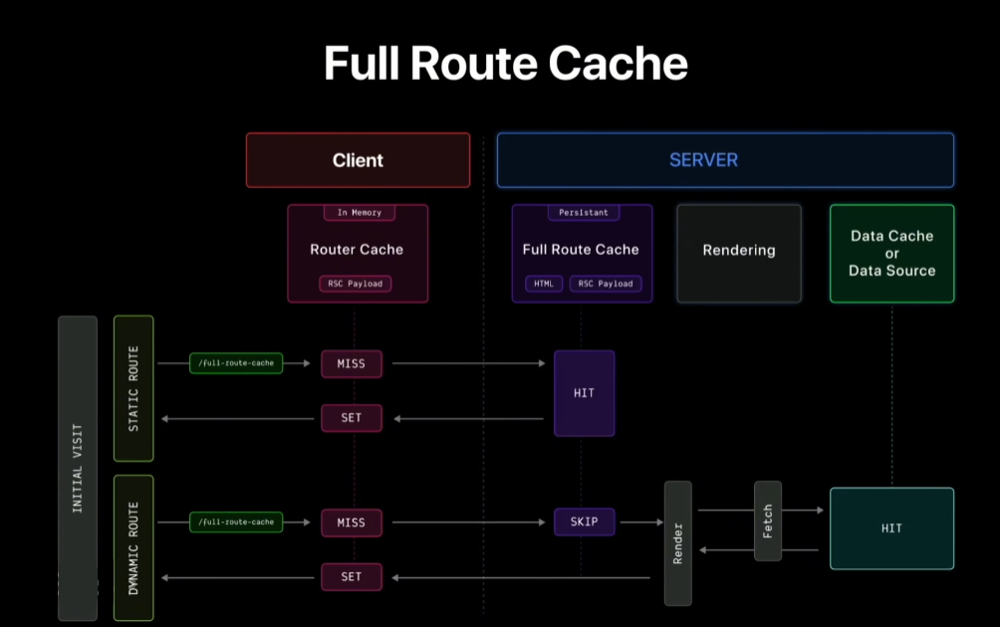

# ⚡ Next.js — Full Route Cache (Cache de route complet)



> _Schéma du flux de fonctionnement du Full Route Cache entre le client et le serveur._

---

## 📋 Vue d'ensemble

Le **Full Route Cache** est un mécanisme de mise en cache automatique dans **Next.js** qui stocke le résultat du rendu d'une route côté serveur.  
Il améliore drastiquement les performances en évitant de re-rendre les pages à chaque requête.

---

## 🎯 Objectif

- 🚀 **Réduire les temps de réponse** en servant du contenu pré-rendu
- 🧠 **Diminuer la charge serveur** en évitant les calculs répétés
- 💰 **Optimiser les coûts** d'infrastructure et de computing
- ⚡ **Améliorer l'expérience utilisateur** avec des chargements instantanés

---

## 🔄 Flux de fonctionnement

### 1️⃣ Premier rendu (Build ou Revalidation)

```
Requête → Rendering → RSC Payload + HTML → Full Route Cache (Serveur)
```

- Next.js rend les **React Server Components**
- Génère un **RSC Payload** (format optimisé React)
- Produit le **HTML statique**
- Stocke les deux dans le cache serveur

### 2️⃣ Requêtes suivantes

```
Requête → Cache HIT → HTML + RSC Payload (depuis cache) → Client
```

- Vérifie le **Full Route Cache**
- Si présent : sert directement le contenu mis en cache
- Si absent : effectue un nouveau rendu et met en cache

### 3️⃣ Côté client

```
HTML (affichage immédiat) → RSC Payload (hydratation) → Page interactive
```

- Le HTML s’affiche instantanément
- Le payload React synchronise et rend la page interactive
- Le **Router Cache** conserve la route en mémoire

---

## 📊 Comparaison : Routes statiques vs dynamiques

| Critère             | Routes Statiques                   | Routes Dynamiques                  |
| ------------------- | ---------------------------------- | ---------------------------------- |
| **Mise en cache**   | ✅ Automatique                     | ❌ Non mise en cache               |
| **Moment de rendu** | Build time ou revalidation         | À chaque requête                   |
| **Performance**     | Excellente                         | Variable                           |
| **Cas d'usage**     | Blog, documentation, landing pages | Dashboard user, données temps réel |
| **Contenu**         | Identique pour tous                | Personnalisé par utilisateur       |

---

## ⏱️ Durée et persistance du cache

### Durée de vie

- **Par défaut** : persistante jusqu’à invalidation ou redéploiement
- **Configurable** via `revalidate` :

```js
export const revalidate = 3600; // Revalide toutes les heures
```

### Invalidation du cache

Le Full Route Cache est invalidé dans ces cas :

1. **Revalidation temporelle**

```js
export const revalidate = 60; // Toutes les 60 secondes
```

2. **Revalidation à la demande**

```js
import { revalidatePath, revalidateTag } from "next/cache";

revalidatePath("/blog/[slug]");
revalidateTag("posts");
```

3. **Mutation de données**

```js
"use server";
export async function createPost(data) {
  await db.posts.create(data);
  revalidatePath("/blog");
}
```

4. **Nouveau déploiement**
   > Le cache est vidé à chaque build ou déploiement.

---

## 🚫 Désactivation du Full Route Cache

### 1️⃣ `dynamic = 'force-dynamic'`

```js
export const dynamic = "force-dynamic";
```

### 2️⃣ `revalidate = 0`

```js
export const revalidate = 0;
```

### 3️⃣ Utiliser des fonctions dynamiques

```js
import { cookies, headers } from "next/headers";

export default async function Page() {
  const cookieStore = cookies(); // Rend la route dynamique
  const headersList = headers();
  return <div>Page dynamique</div>;
}
```

---

## 🎭 Interaction avec les autres caches

```
┌─────────────────┐
│  Data Cache     │ (fetch automatiquement mis en cache)
└────────┬────────┘
         ↓
┌─────────────────┐
│ Full Route      │ (HTML + RSC Payload mis en cache)
│ Cache (Serveur) │
└────────┬────────┘
         ↓
┌─────────────────┐
│ Router Cache    │ (Cache côté client)
│ (Client)        │
└─────────────────┘
```

---

## 💡 Bonnes pratiques

### ✅ À faire

1. **Utiliser ISR (Incremental Static Regeneration)**

```js
export const revalidate = 3600;
```

2. **Taguer les données**

```js
fetch("https://api.example.com/posts", {
  next: { tags: ["posts"] },
});
revalidateTag("posts");
```

3. **Séparer statique et dynamique**

```js
export default function Page() {
  return (
    <>
      <StaticHeader /> {/* Mis en cache */}
      <DynamicUserContent /> {/* Rendu dynamique */}
    </>
  );
}
```

### ❌ À éviter

1. **Ne pas mettre en cache des données sensibles**

```js
// ❌ Mauvais
export default async function Profile() {
  const user = await getCurrentUser();
  return <div>{user.email}</div>;
}

// ✅ Bon
export const dynamic = "force-dynamic";
```

2. **Éviter de désactiver le cache par défaut sans raison**
3. **Toujours revalider après une mutation**

---

## 🔍 Debugging

### Vérifier si une route est en cache

- `○ (Static)` → Route mise en cache
- `λ (Dynamic)` → Rendu à la demande
- `ƒ (Dynamic)` → Fonctions dynamiques présentes

---

## 📚 Résumé

| Concept           | Description                                                    |
| ----------------- | -------------------------------------------------------------- |
| **Quoi**          | Cache du rendu complet d'une route (HTML + RSC Payload)        |
| **Où**            | Côté serveur                                                   |
| **Quand**         | Routes statiques au build ou après revalidation                |
| **Durée**         | Persistant jusqu'à invalidation                                |
| **Invalidation**  | `revalidate`, `revalidatePath`, `revalidateTag`, redéploiement |
| **Désactivation** | `dynamic = 'force-dynamic'` ou `revalidate = 0`                |

---

## 🔗 Relations avec les autres concepts

- **Data Cache** → Cache des réponses `fetch()`
- **Request Memoization** → Déduplique les requêtes identiques
- **Router Cache** → Cache mémoire côté client

Le **Full Route Cache** est la **dernière étape d’optimisation** du rendu, offrant les meilleures performances possibles pour les routes statiques.

---
