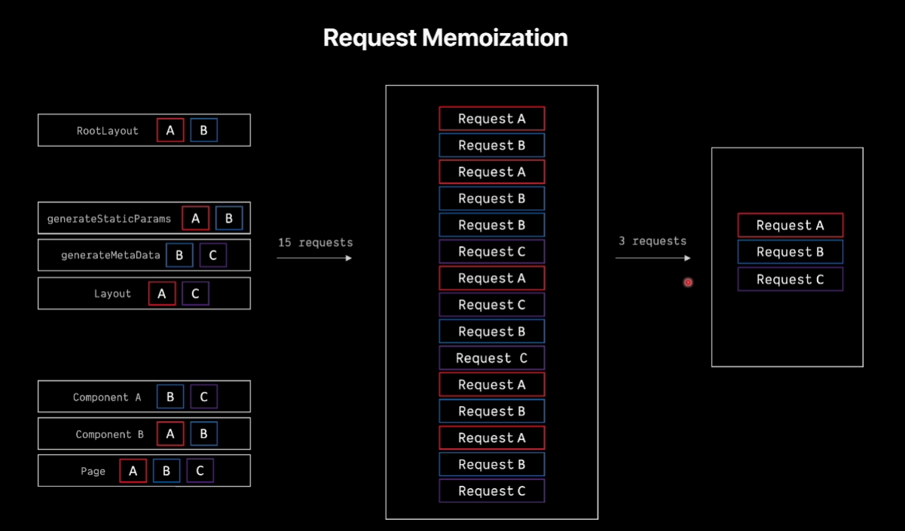

# 🧠 Request Memoization dans Next.js

## 🚀 Introduction

La **Request Memoization** est un mécanisme d’optimisation introduit par **React.js** (et non exclusivement par Next.js) permettant d’éviter les requêtes réseau répétées pendant le rendu.  
Lorsque plusieurs composants exécutent le même `fetch()` (avec la même URL et les mêmes options), une seule requête est réellement envoyée. Les autres partagent la même **Promise**.

➡️ En clair : **Next.js ne met pas en cache les données**, mais **la Promesse en cours d’exécution** pendant un cycle de rendu.

---

## ⚙️ Fonctionnement simplifié

1. Lorsqu’un `fetch()` est appelé :

   - Si aucune Promesse identique n’existe → la requête est envoyée (**MISS**)
   - La Promesse est stockée en mémoire temporairement (**SET**)
   - Si un autre composant appelle le même `fetch()` → il réutilise la même Promesse (**HIT**)

2. Quand la Promesse se résout, **tous les composants obtiennent la même réponse**.
3. Une fois le rendu terminé, **tout est effacé de la mémoire** — pas de persistance entre requêtes.

---

## 🖼️ Visualisation (Diagrammes)

### 1. Processus de mémoïsation côté serveur

Ce schéma illustre le fonctionnement interne :

- Une première requête `fetch('/products')` crée une Promesse → **MISS → SET**
- Une seconde requête identique réutilise la Promesse → **HIT**
- La Promesse reste en mémoire uniquement durant le rendu


---

### 2. Propagation dans l’arbre React

Le second diagramme montre où la mémoïsation s’applique :

- Dans les **composants serveurs React** : `layout.js`, `page.js`, `generateMetadata`, `generateStaticParams`
- Pas dans les **route handlers** ni le **middleware**



---

## 🧩 Points importants à retenir

✅ **Fonctionnalité React.js, pas spécifique à Next.js**  
→ Next.js exploite la mémoïsation intégrée à React pour gérer les `fetch()` serveur.

✅ **S’applique uniquement aux requêtes GET**  
→ Les requêtes POST, PUT, PATCH, DELETE ne sont pas mémoïsées.

✅ **Fonctionne uniquement dans l’arbre React serveur**  
→ Active dans `generateMetadata`, `generateStaticParams`, `layout.js`, `page.js`…  
❌ Non disponible dans les route handlers (`app/api/...`) ni dans le middleware.

✅ **Pas de cache côté middleware**  
→ Le `fetch()` dans le middleware n’est pas pris en charge par le cache interne de React/Next.js.

---

## 🌐 Comportement selon le mode

### 🔹 SSR (Server-Side Rendering)

- Mémoïsation active **pendant un seul rendu serveur**
- Chaque requête utilisateur crée un nouveau contexte de mémoïsation
- Empêche toute fuite de données entre utilisateurs

### 🔹 SSG (Static Site Generation)

- Pendant le `next build`, les appels identiques à `fetch()` sont dédupliqués
- Une fois la page générée, les données sont figées dans le HTML statique
- Aucun cache n’existe à l’exécution

---

## 💡 Bonnes pratiques

- 🔸 Utilisez toujours le `fetch()` natif de Next.js (pas axios ou node-fetch)
- 🔸 Gardez les URLs et options identiques pour profiter de la déduplication
- 🔸Request Memoization (mémoïsation de la Promesse) fonctionne même avec { cache: "no-cache" }, mais uniquement pendant le rendu React serveur en cours.
- 🔸 Pour combiner mémoïsation + cache persistant, utilise next: { revalidate }.
- 🔸 Pour forcer un fetch toujours frais, utilise cache: "no-cache".

## 1️⃣ next: { revalidate: 3600 }

- Active le **cache persistant** côté Next.js.
- Les données seront **mises en cache pendant 1 heure**.
- Utile pour **SSG/ISR** afin de réduire les requêtes répétées vers ton API.

```js
fetch("https://api.example.com/data", {
  next: { revalidate: 3600 },
});
```

## 2️⃣ { cache: "no-cache" }

- Désactive toute mise en cache HTTP pour ce fetch().
- Next.js ne stockera pas les données, même temporairement.
- Chaque appel déclenchera une nouvelle requête réseau, même si une Promesse identique est en cours.

```js
fetch("https://api.example.com/data", {
  cache: "no-cache",
});
```
