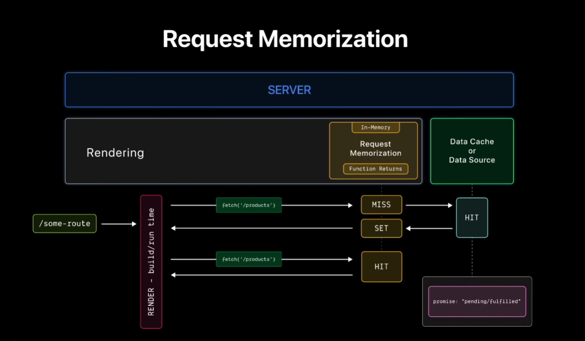

# 🔁 Mémorisation des requêtes dans Next.js

Ce document explique simplement comment fonctionne la **mémorisation des requêtes (request memorization)** dans un environnement **Next.js** lors du rendu côté serveur (Server Components ou SSR).

---

## 🧩 Aperçu

Lorsqu’une page (par exemple `/products`) est demandée, Next.js la rend côté serveur.  
Pendant ce processus, l’application peut exécuter `fetch('/products')` pour récupérer des données.

Pour éviter de refaire plusieurs fois la même requête pendant le rendu, **Next.js mémorise** (met en cache) les appels `fetch`.  
Cela permet de gagner du temps et de réduire la charge sur les serveurs et APIs externes.

---
### 📊 Diagramme explicatif


> *Ce schéma illustre le fonctionnement du cache en mémoire de Next.js : une requête est vérifiée, puis stockée ou réutilisée selon qu’il s’agit d’un “cache hit” ou “cache miss”.*

---

## ⚙️ Fonctionnement étape par étape

1. Le serveur commence à rendre la page demandée.  
2. Quand `fetch('/products')` est exécuté :
   - Next.js vérifie sa **mémoire cache interne**.
   - Si c’est la **première fois** que cette requête est faite → **Cache manqué (MISS)** :
     - Next.js récupère les données à la source (API, base de données, etc.).
     - Une fois les données reçues, elles sont **stockées en mémoire** pour ce cycle de rendu.
   - Si la **même requête** est exécutée à nouveau avec les mêmes paramètres → **Cache réussi (HIT)** :
     - Next.js renvoie directement le **résultat déjà en mémoire**, sans refaire la requête.

---

## 🚀 Pourquoi c’est utile

- ⚡ **Rendu plus rapide** — moins d’appels réseau répétitifs.  
- 🧩 **Cohérence des données** — tous les composants utilisent les mêmes résultats.  
- 💾 **Efficacité serveur** — réduction de la charge sur les APIs et bases de données.  

---

## 💡 En pratique

Lorsque tu utilises `fetch()` dans un **composant serveur** (Server Component) dans Next.js :

- La **mémorisation** est **automatique** pour tout le cycle de rendu.  
- Si le même `fetch()` est appelé plusieurs fois avec la même URL et les mêmes options, Next.js renverra la **même promesse** ou le **résultat déjà résolu**.  
- Cela est particulièrement utile pour :
  - Les **layouts**
  - Les **routes parallèles**
  - Les **composants partagés**  

---

## 📈 Exemple simplifié

```js
// Exemple : mémorisation automatique du fetch dans un composant serveur
export default async function ProductPage() {
  const products = await fetch('https://api.example.com/products').then(res => res.json())

  // Si d’autres composants appellent le même fetch pendant le rendu :
  // ✅ Next.js réutilisera ce résultat sans refaire la requête.
  
  return (
    <div>
      <h1>Produits</h1>
      <pre>{JSON.stringify(products, null, 2)}</pre>
    </div>
  )
}
