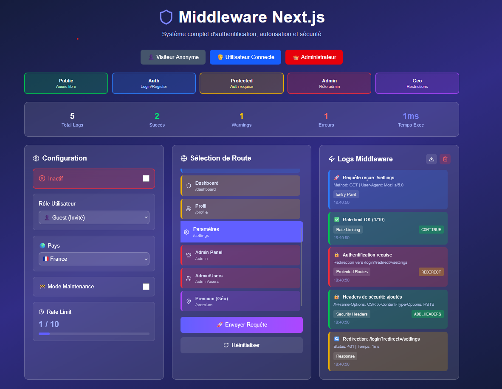

# 🧩 Middleware Next.js – Authentification, Autorisation & Sécurité

Ce projet illustre un **système complet de gestion des accès dans une application Next.js**, basé sur le **Middleware intégré**.  
Il gère plusieurs aspects essentiels : l’authentification, les rôles utilisateurs, la sécurité, la géolocalisation et la limitation de requêtes.

---

## 🚀 Présentation

Le **Middleware** dans Next.js agit **avant que la requête atteigne la page ou l’API**.  
Il permet de modifier la réponse, rediriger, réécrire ou ajouter des headers selon des conditions précises.

Ce projet démontre comment :

- Restreindre certaines routes selon le rôle ou la géolocalisation ;
- Appliquer des headers de sécurité ;
- Gérer un mode maintenance ;
- Implémenter un **rate limiting** simple ;
- Rediriger dynamiquement les utilisateurs selon leur statut d’authentification.

---

## ⚙️ Fonctionnement Global

### 1️⃣ Définition des Routes

Le middleware distingue plusieurs catégories de routes :

```ts
const publicRoutes = ["/", "/about"];
const authRoutes = ["/login", "/register"];
const protectedRoutes = ["/dashboard", "/profile", "/settings"];
const adminRoutes = ["/admin", "/admin/users"];
const restrictedGeoRoutes = ["/premium", "/exclusive"];
```

---

### 2️⃣ Authentification & Rôles

Le middleware lit les **cookies** pour déterminer si l’utilisateur est connecté et quel est son rôle :

```ts
const isAuthenticated = request.cookies.get("auth_token")?.value ? true : false;
const userRole = request.cookies.get("user_role")?.value || "guest";
```

➡️ Si un utilisateur tente d’accéder à une route protégée sans être connecté,  
il est redirigé vers `/login?redirect=/page-demandée`.

➡️ Si un utilisateur authentifié accède à `/login` ou `/register`,  
il est automatiquement redirigé vers le **Dashboard**.

---

### 3️⃣ Rate Limiting

Pour éviter les abus, un **compteur de requêtes** est stocké dans les cookies.  
Au-delà de 10 requêtes par heure, la réponse renvoie un code `429 Too Many Requests`.

```ts
if (requestCount >= 10) {
  return new NextResponse("Too Many Requests", { status: 429 });
}
```

---

### 4️⃣ Mode Maintenance

Un flag d’environnement (`MAINTENANCE_MODE=true`) permet de bloquer l’accès à toutes les pages sauf `/maintenance`, sauf pour les administrateurs :

```ts
if (isMaintenanceMode && userRole !== "admin" && pathname !== "/maintenance") {
  return NextResponse.rewrite(new URL("/maintenance", request.url));
}
```

---

### 5️⃣ Géolocalisation

Grâce à `request.geo`, certaines routes peuvent être bloquées pour des pays spécifiques :

```ts
const blockedCountries = ["CN", "KP"];
if (
  restrictedGeoRoutes.some((r) => pathname.startsWith(r)) &&
  blockedCountries.includes(country)
) {
  return NextResponse.redirect(new URL("/geo-restricted", request.url));
}
```

---

### 6️⃣ Sécurité : Headers HTTP

Le middleware ajoute automatiquement plusieurs headers de sécurité :

```ts
response.headers.set("X-Frame-Options", "DENY");
response.headers.set("X-Content-Type-Options", "nosniff");
response.headers.set("Referrer-Policy", "strict-origin-when-cross-origin");
```

Ces headers protègent contre les attaques de type **Clickjacking**, **MIME Sniffing** et améliorent la confidentialité.

---

## 🛠️ Configuration du Matcher

Le middleware s’applique à toutes les routes sauf celles de l’API et des fichiers statiques :

```ts
export const config = {
  matcher: ["/((?!api|_next/static|_next/image|favicon.ico|.*.png$).*)"],
};
```

---

## 📸 Aperçu



---
