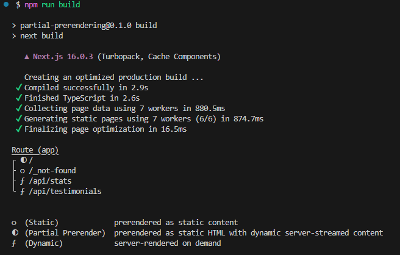

# Guide d'installation de PPR avec Next.js

Instructions détaillées étape par étape pour faire fonctionner la
démonstration de **Partial Pre-rendering (PPR)**.

## 1. Activer PPR dans la configuration Next.js

Remplacez le contenu de `next.config.js` :

```javascript
cacheComponents: true, // Active PPR et la mise en cache des composants
```

## 2. Lancer le serveur de développement

```bash
npm run dev
```

Visitez : `http://localhost:3000`

## Vérification de la configuration PPR

### Vérification 1 : Résultat du build



Le symbole `◐` indique que le **Partial Pre-rendering** est actif.

### Vérification 2 : Voir le code source de la page

Clic droit → « Afficher le code source ».

Vous devriez voir : - ✅ Contenu statique (Hero, Fonctionnalités,
Tarifs, FAQ) directement dans le HTML\

- ⏳ Limites de Suspense avec des marqueurs `<!--$-->` pour les sections
  dynamiques

### Vérification 3 : Onglet Réseau

Ouvrez DevTools → Réseau :

1.  **Chargement initial :** Ne reçoit que le shell HTML statique\
2.  **Après le chargement :** Requêtes séparées vers `/api/testimonials`
    et `/api/stats`\
3.  **Streaming progressif :** Le contenu apparaît progressivement

### Vérification 4 : Limitation du réseau

DevTools → Réseau → Throttling → Slow 3G

Rechargez la page : - Le contenu statique apparaît instantanément\

- Skeleton loaders pour les sections dynamiques\
- Le contenu se charge progressivement


## 🎥 Démo de l’application


Voici une démonstration en vidéo de l’application :

